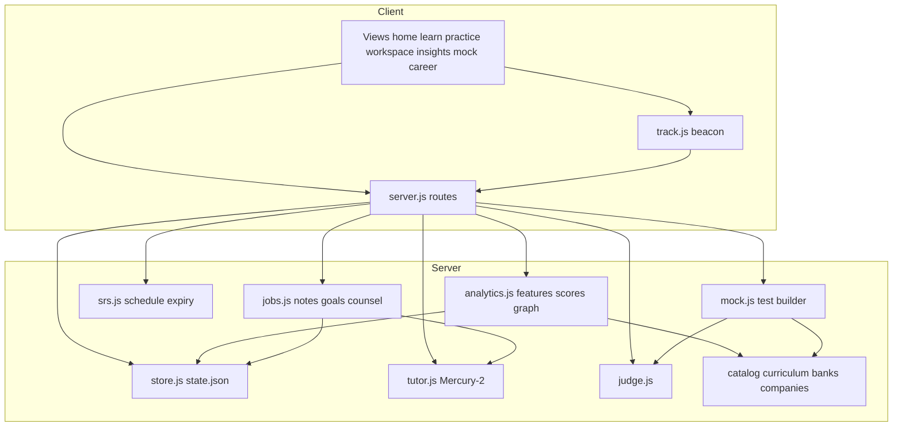

# Requirements

### Overview & Goals
Upgrade **Java DSA Studio** from progress heatmaps + tutor memory into a **personal Learning OS**: continuous behaviour capture, a **knowledge graph**, explainable **mastery / company-fit scores**, **spaced repetition**, **timed mock tests**, **daily goals**, **session notes**, **2×/week career counselling**, and a **personal records** board — all local-first on the existing Node + `state.json` stack, with **Mercury-2** for narrative reports and counselling (not for raw scoring).

### Scope
#### In scope
- Event stream of learning behaviour (opens, reads, runs, fails, tutor use, idle vs active coding).
- Interconnected **topic ↔ lesson ↔ problem** knowledge map with mastery, half-life (expiry), and edges (prereq / co-practice).
- Hybrid **feature engine** (deterministic “ML-style” signals from your data) + Mercury for insights copy and career chats.
- Real-time-ish **company hiring potential** from guided topics ∩ company question banks + your mastery/accuracy.
- **Test maker**: strict timed quizzes from learned/expiring topics; scored; feeds mastery.
- Daily goals checklist, reminders, revision queue.
- Silent post-session **auto-notes** distilled into tutor memory + a notes feed.
- Career counselling schedule (2 fixed slots/week) grounded in scores + target companies.
- Dashboard: graph, scores, personal leaderboard vs past self.
- Persist everything under `web/data/store/` (gitignored); API surface for new UI views.

#### Out of scope
- Multi-user cloud accounts, real competitive leaderboards, Python/GPU training pipelines.
- Changing the Java judge harness or expanding the LeetCode bank (already 57 guided).
- Mobile/Android client (this product is the `web/` studio).
- **Seeded / fake learner analytics** — no demo persona, no pre-filled mastery, streaks, company-fit %, or invented events in the production store.
- Training a neural net or shipping a black-box model that needs a multi-user corpus (v1 is explainable features + weights on *this* learner’s log).

#### Real data vs content vs “mock” wording
- **Real (you):** events, attempts, judge results, chats, notes, goals completion, mock-*test* scores, personal records.
- **Content (not fake progress):** curriculum chapters, guided bank, company question maps — the syllabus, not your history.
- **“Mock” in this plan** always means **timed practice exam**, never mock/stub analytics data.
- **AI (Mercury-2):** narrative only (session notes, insight prose, career counselling), grounded on the real feature vector; scores work offline without AI.
- **Empty learner:** Insights show empty/CTA states — never padded numbers.

### User Stories
- As a learner, I want the app to **remember how I actually study** (not only pass/fail) so advice matches reality.
- As a learner, I want a **map of DSA knowledge** that fades over time so I know what to revise.
- As an interview candidate, I want **per-company readiness** and weekly **career counselling** so I pick realistic targets.
- As a learner, I want **strict timed tests** generated from what I studied so revision is measurable.
- As a learner, I want **daily goals + reminders** and **session notes** without writing them myself.

### Functional Requirements
1. **Behaviour capture** — instrument lesson open/complete, problem open, editor keystroke activity buckets, Run/Submit outcomes, tutor messages, time-on-task; append-only events + rollups.
2. **Feature / “ML” layer** — compute per-topic: accuracy, median attempts-to-solve, tutor-dependence ratio, recency, consistency; per-company fit; coding-style flags (e.g. thrash runs, long idle). Pure JS, versioned formulas, explainable factors returned to UI.
3. **Knowledge graph** — nodes = topics + chapters + guided problems; edges = curriculum prereqs + shared topics; UI graph/list hybrid on Insights.
4. **Expiry / SRS** — on lesson complete / problem solve, schedule `nextReviewAt` with decaying mastery; overdue items enter daily revise queue.
5. **Test maker** — build N-question timed sessions from bank + weak/expiring topics; lock navigation; score; write attempts into store; optional “exam mode” hides hints/tutor until submit.
6. **Daily goals** — from profile `dailyMinutes` + path; checklist (lessons, problems, revise, mock); reminder endpoint + soft UI banner.
7. **Session notes** — on leaving lesson/workspace (or idle end), Mercury summarises thread + outcomes → `notes[]` + memory facts.
8. **Career days** — profile `counselDays` (default e.g. Wed/Sun); dedicated view with readiness narrative, company shortlist, next 14-day plan.
9. **Personal records** — best streak, best mock score, weekly XP vs last week, topic PRs — no other users.
10. **Dashboard** — single Insights home section or `#/insights` with map summary, readiness, goals, overdue, records.

### Non-Functional Requirements
- Local-only; no mandatory network except Mercury.
- Scoring must work **offline** when tutor is down.
- Event log capped/rotated (e.g. last 90 days raw, forever rollups).
- Do not store API keys in git; keep `MERCURY_API_KEY` in `web/.env`.
- Keep vanilla ES modules UI consistent with existing `h()` / shell patterns.

# Technical Design

### Current Implementation
- **Persist:** `web/lib/store.js` → `data/store/state.json` — `profile`, `progress.lessons/problems`, `activity` day buckets, `memory`, `chats`.
- **Judge:** `web/lib/judge.js` + banks; attempts via `recordAttempt` (passed/total, code draft, topics, elapsed).
- **Tutor:** `web/lib/tutor.js` Mercury-2, memory distillation, `prepPlan`.
- **API:** `web/server.js` bootstrap, progress, next-up, companies, tutor.
- **UI:** hash routes — home, learn, lesson, practice, progress, workspace; progress has heatmap + strengths chips + memory list only.
- **Catalog structure (syllabus, not learner fake data):** chapters/lessons/topics in curriculum + `catalog.js` company×topic links form graph *edges*; mastery values start empty until you practice.

### Key Decisions
1. **Hybrid analytics, not a black-box model** — A versioned **feature engine** (`lib/analytics.js`) computes mastery and company-fit **only from this learner’s real events/progress** (logistic-style weights on transparent features; default coefficients are formula constants, not fake user history). Mercury turns the same feature vector into prose reports and counselling. Rationale: works offline, debuggable, matches “ML on my behaviour” without a training corpus; formulas can later be replaced by a fitted model using the same feature schema. **Never seed `events` / `topics` / `records` for a prettier dashboard.**
2. **Append-only `events[]` + materialised rollups** — UI never scans full history; `summary()` / `insights()` read rollups. Rationale: single-file store stays simple; rotation keeps size bounded.
3. **SRS mastery on topics, not only problems** — Completing a lesson or guided problem updates topic nodes; problems inherit topic decay. Rationale: daily tests and company-fit need topic-level state.
4. **Timed exams (“mocks”) are first-class sessions** in store (`mocks[]`) using the **real guided bank + Java judge** for graded items — not stub scores. Rationale: one truth path for scoring.
5. **Personal leaderboard = time-series of self** — weekly snapshots in `records`. Rationale: user choice; no multi-tenant backend.
6. **Silent agents = scheduled + hook-driven jobs** inside the Node process (on request edges + lightweight interval): note writer, goal evaluator, expiry sweeper — not separate OS daemons.

### Architecture Diagram


### Data Models / Contracts
Extend `state.json` (version bump → 2):
```js
{
  events: [{ id, ts, type, payload }], // open_lesson, complete_lesson, open_problem, run, submit, tutor_msg, focus_ms, mock_* 
  topics: { [slug]: { mastery:0-1, stabilityDays, lastSeenAt, nextReviewAt, attempts, passes, tutorAssists, avgAttempts } },
  graphMeta: { updatedAt }, // optional cached adjacency stats
  goals: { date, items:[{id,label,done,kind}], xp },
  notes: [{ id, ts, source, title, bodyMd, topicSlugs }],
  mocks: [{ id, startedAt, endsAt, mode, itemIds, results, score, strict }],
  records: { bestStreak, bestMockScore, weeks: { 'YYYY-Www': { xp, solved, accuracy } } },
  counsel: { daysOfWeek:[3,0], lastSessionAt, history:[] },
  insightsCache: { at, companyFit:[], strengths:[], focus:[], codingPatterns:[] }
}
```
Feature vector (per topic / global), example:
- `accuracy`, `logAttempts`, `recencyHalflife`, `tutorRatio`, `activeCodingRatio`, `streakConsistency`, `difficultyWeightedSolve`

Company fit:
`fit(c) = weighted_avg(mastery(topic) for topic in companyTopTopics) * coverage(guided∩company) * recentMockFactor`

APIs (additive):
- `POST /api/events` batch beacon
- `GET /api/insights` → scores, graph summary, patterns, companyFit top N, explain[]
- `GET /api/graph` → nodes/edges for viz
- `GET /api/revise` → due topic/problem queue
- `GET|POST /api/goals/today`
- `POST /api/mocks` start, `POST /api/mocks/:id/answer`, `POST /api/mocks/:id/finish`
- `GET /api/notes`, `POST /api/sessions/end` → triggers note job
- `GET /api/counsel/next`, `POST /api/counsel/chat`
- `GET /api/records`

### Proposed Changes
 Area | Files |
------|--------|
 Store schema + event APIs | `lib/store.js`, `server.js` |
 Feature engine + company fit | **new** `lib/analytics.js` |
 SRS | **new** `lib/srs.js` |
 Mock builder | **new** `lib/mock.js` |
 Background-ish jobs | **new** `lib/jobs.js` |
 Tutor prompts for notes/counsel | `lib/tutor.js` |
 Client beacon | **new** `public/js/track.js`, wire in `app.js` / workspace / lesson |
 UI | **new** `views/insights.js`, `views/mock.js`, `views/career.js`; extend `home.js`, `progress.js`, `api.js`, `style.css` |
 Docs | `README.md` section Learning OS |

### Components
- **Insights dashboard** — mastery bars, mini graph (CSS/SVG force-lite or adjacency list if full graph heavy), company-fit cards, pattern callouts, personal records.
- **Revise / Mock flow** — timer, strict mode, score breakdown by topic.
- **Goals strip** — on home + shell.
- **Career** — calendar cue + Mercury counsel grounded in `GET /api/insights`.
- **Existing progress** — keep heatmap; deep-link to Insights.

### Risks
- **state.json growth** — mitigate with event rotation + rollups.
- **Mercury cost/latency on every navigation** — notes/counsel only on session end / counsel days; scores always local.
- **“ML” expectations** — document that v1 is **explainable weighted models on real behaviour**; expose factor breakdown so it feels analytical, not magical. No seed data to “demo” ML.
- **Graph clutter** — default to topic-level map; expand to problems on drill-in.
- **Strict mock vs tutor** — hard-disable tutor panel in exam mode via route flag.

# Testing

### Validation Approach
- Unit-style Node scripts for analytics/SRS pure functions (fixture events → expected mastery/fit).
- Extend `web/tools/smoke.js` with new routes and a fake event batch.
- Manual: complete a lesson, fail/pass a guided problem, finish a mock, confirm goals/revise/insights update with tutor off.

### Key Scenarios
1. Events from lesson + submit update topic mastery and company fit without Mercury.
2. Overdue topic appears in `/api/revise` after simulated clock / lowered `nextReviewAt`.
3. Mock start → answers → finish writes score into `mocks` and `records`.
4. Session end creates a note when Mercury ready; graceful skip when not.
5. Counsel endpoint returns shortlist using targetCompany + fit rankings.
6. Personal records reflect best mock and weekly XP delta.

### Edge Cases
- Empty learner (no events) → friendly empty Insights + onboarding CTA.
- Tutor 503 → scores/goals/mocks still work.
- Corrupt/partial v1 state → migrate to v2 defaults.
- Event flood → batching + max events/day cap.

# Delivery Steps

### ✓ Step 1: Behaviour events and store v2
Learner actions append to a durable event log and rollups; state schema is version 2.

- Extend `web/lib/store.js` with `events`, `topics`, `goals`, `notes`, `mocks`, `records`, `counsel`, migration from v1.
- Add `POST /api/events` and wire `public/js/track.js` from lesson/workspace/app lifecycle (open, focus time buckets, run/submit already mirrored from judge hooks).
- Cap/rotate raw events; keep `summary()` backward compatible for existing Progress view.
- Smoke: post events → reload state file contains them.

### ✓ Step 2: Feature engine, knowledge graph, company fit
Offline insights API returns mastery, patterns, graph, and per-company potential with factor breakdowns.

- Add `lib/analytics.js`: topic features, coding-behaviour flags, company-fit using catalog company questions × topic mastery.
- Add `GET /api/insights` and `GET /api/graph`.
- Cache snapshot on `insightsCache` invalidated by new events/attempts.
- Unit fixtures for accuracy/tutorRatio/fit math.

### ✓ Step 3: Spaced repetition, daily goals, revise queue
Learned items get expiry; home shows today’s checklist and due revisions.

- Add `lib/srs.js` updating `topics.*.mastery/nextReviewAt` on lesson complete and problem solve.
- `GET /api/revise`, `GET|POST /api/goals/today` generated from profile path + weak/due topics.
- UI: goals strip on `home.js`; revise section on Insights/Progress.
- Reminder banner when daily minutes or checklist incomplete.

### ✓ Step 4: Timed test maker and scoring loop
Strict timed mocks from learned/weak topics run through the real judge and update mastery/records.

- Add `lib/mock.js` + routes start/answer/finish.
- New `views/mock.js` with timer, locked tutor in strict mode, score report.
- Feed results into analytics + `records.bestMockScore` / weekly XP.
- Extend smoke for mock happy path with one guided problem.

### ✓ Step 5: Session notes, career counselling, Insights UI, personal records
Full Learning OS surface: silent notes, 2×/week career path, dashboard graph, self-leaderboard.

- `lib/jobs.js` + `POST /api/sessions/end` → Mercury note → `notes` + memory facts.
- Counsel schedule in profile; `views/career.js` + tutor mode grounded on insights payload.
- `views/insights.js` (map, fits, patterns, records, notes feed); nav entry in shell/home.
- README Learning OS section; final smoke + manual checklist with tutor on/off.

### ✓ Step 6: Placement-ready assessment v1
Make scores and revision plans evidence-backed rather than adding more dashboard-only features.

- Add topic diagnostics and calibrated mock blueprints with balanced difficulty/topic coverage.
- Add private generated judge cases that are not exposed in problem payloads, while preserving deterministic local runs.
- Rename unsupported hiring-probability language to topic/company readiness and cite exact evidence behind recommendations.
- Generate an adaptive 7-day revision plan from due topics, diagnostic gaps, and independent solve history.
- Add unit and smoke coverage for diagnostic scoring, hidden cases, empty learners, and revision-plan stability.

### ✓ Step 7: Active-learning curriculum quality
Turn passive lessons into measurable learning units before scaling the catalog broadly.

- Add prerequisite diagnostics, retrieval checkpoints, common misconceptions, and post-solve reflection.
- Persist checkpoint outcomes and feed them into mastery without treating reading as a solved coding problem.
- Expand the deeply curated executable bank in reviewed batches, keeping every reference solution verified.

### ✓ Step 8: Secure execution and durable learner data
Make long-term local use safe and recoverable.

- Isolate Java execution with strict CPU, memory, process, filesystem, and network limits appropriate to the host.
- Write state atomically with backup rotation, corruption recovery, and export/import validation.
- Add audit-friendly schema migrations and recovery tests that never touch the learner's real store.

### ✓ Step 9: Browser quality, accessibility, and performance
Validate the product as a usable application, not only an API implementation.

- Add browser end-to-end tests for onboarding, lessons, solving, mocks, revision, insights, and tutor-off behavior.
- Add keyboard/focus semantics, screen-reader labels, reduced-motion support, responsive checks, and accessibility audits.
- Add visual regression and performance budgets for the main learning routes.

### ✓ Step 10: Complete placement preparation tracks
Cover the non-DSA skills required for placements after assessment and platform reliability are established.

- Add CS fundamentals, system design, behavioral communication, resume/project review, and application tracking.
- Build evidence-based interview simulations and rubrics rather than claiming hiring probability.
- Calibrate recommendations only from real longitudinal outcomes; never seed learner metrics.

### ✓ Step 11: AI tutor algorithm visualizations
Turn tutor explanations into safe, replayable visual traces synchronized with the Java workspace.

- Add a validated structured visualization payload to tutor responses without relying on free-form executable output.
- Render arrays/two pointers, linked lists, trees/graphs, stacks/queues, and DP matrices/recursion trees with accessible SVG/DOM components.
- Add play, pause, next, previous, and speed controls with deterministic step playback.
- Synchronize each visualization step with an active Java source line in the editor and cover payload validation, playback, and browser behavior with tests.